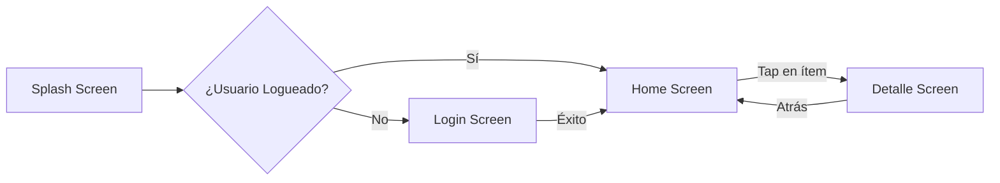

# Flujo de Navegación del Usuario

```mermaid
graph LR
    A[Splash Screen] --> B{¿Usuario Logueado?}
    B -->|No| C[Login Screen]
    B -->|Sí| D[Home Screen]
    C -->|Éxito| D
    D -->|Tap en ítem| E[Detalle Screen]
    E -->|Atrás| D
```
